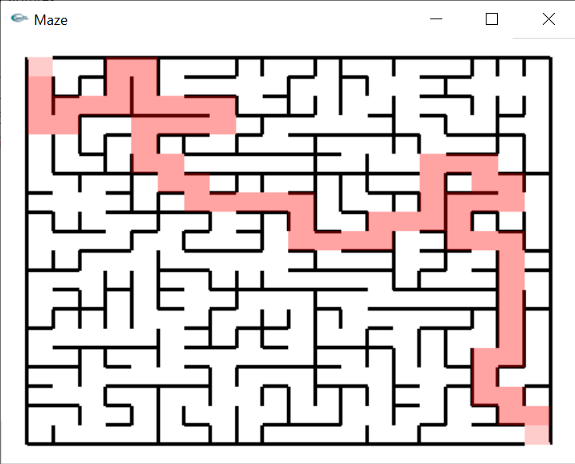

# Building Maze using Disjoint Sets 
Taken from wikipedia. A **maze** is a path or collection of paths, typically from an entrance to a goal.
**Maze generation** is the act of designing the layout of passages and walls within a maze.
**Maze solving** is the act of finding a route through the maze from the start to finish.
**Mazes containing no loops** are known as "standard", or "**perfect**" mazes, and are equivalent to a Tree in graph theory.

We use **disjoint sets for building the maze**. Initially we keep **each node of maze in seperate set**, so they are disjoint. Then by making **union continously** to these disjoint sets, results in lesser disjoint sets, **until all nodes of maze are in one set**. This causes **all nodes in the maze to be reachable to all other nodes** with no edges to block path, **without any loops**. This makes a perfect and also random maze.

Python scripts are used here to **generate maze data using disjoint sets**. They are also used to find path or **solve the maze using Breadth First Search**. C program using **OpenGL is used for rendering the maze**.

## System Requirements

The program compiles and runs on both **Windows and Linux OS**.

**Make** tool is required for compilation.

**python3** is required for running python scripts.

**OpenGL** is required to display the maze.

### For Windows OS
1.  **cl compiler** (download the Build Tools for Visual Studio)

### For Linux OS
1.  **gcc compiler**
2.  Install the required packages for **OpenGL** like **mesa-utils, freeglut3-dev**

## Compiling

1. Open terminal/command prompt (in top level directory) and enter
	> make clean
	
	> make
	
	make will identify the OS and use the right compiler.
	
## Steps to use

1. You need to first **create the maze data** (csv files).
2. Then **display the maze** using the data

By creating this two step process, it **allows to display same maze again and again** in different PCs by using one set of data (csv files).

## Running

1. Open terminal/command prompt (in top level directory) and enter

	1. Create the maze data (csv files)
		> python mazerun.py --create-data [length of maze] [width of maze]
		
			Ex: python mazerun.py --create-data 30 20
			
			NOTE: 	For Linux, use 'python3' everywhere
					Ex: python3 mazerun.py
                    
	2. Display the maze in a window (**3 styles to display**)
		1. **Show the path** in the maze which connects the start node and last node **filled** with color
			> python mazerun.py
		
		2.  **Show the path** in the maze **dotted** with color
			> python mazerun.py --dotted-maze-path

		3. **Don't show the path** in the maze
			> python mazerun.py --dont-show-maze-path
	
2. See results in 'result' directory.

	There are 3 csv files generated on calling with --create-data, these **can be stored or placed on any system** to create same maze again by placing it in the result directory and calling the script.

## References:
https://courses.cs.washington.edu/courses/cse326/08sp/lectures/18-disjoint-union-find.pdf
http://www.songho.ca/opengl/gl_transform.html

## Results

**20x20 maze with filled path**

**20x20 maze with no path**

**20x20 maze with dotted path**

**100x100 maze with filled path**

**100x100 maze with no path**

**100x100 maze with dotted path**

